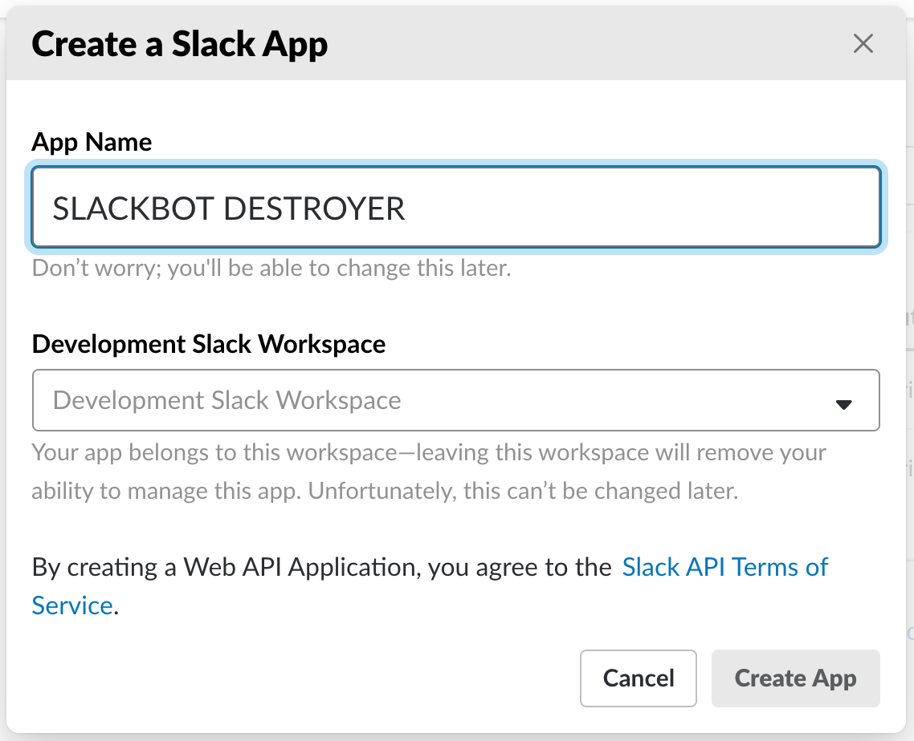
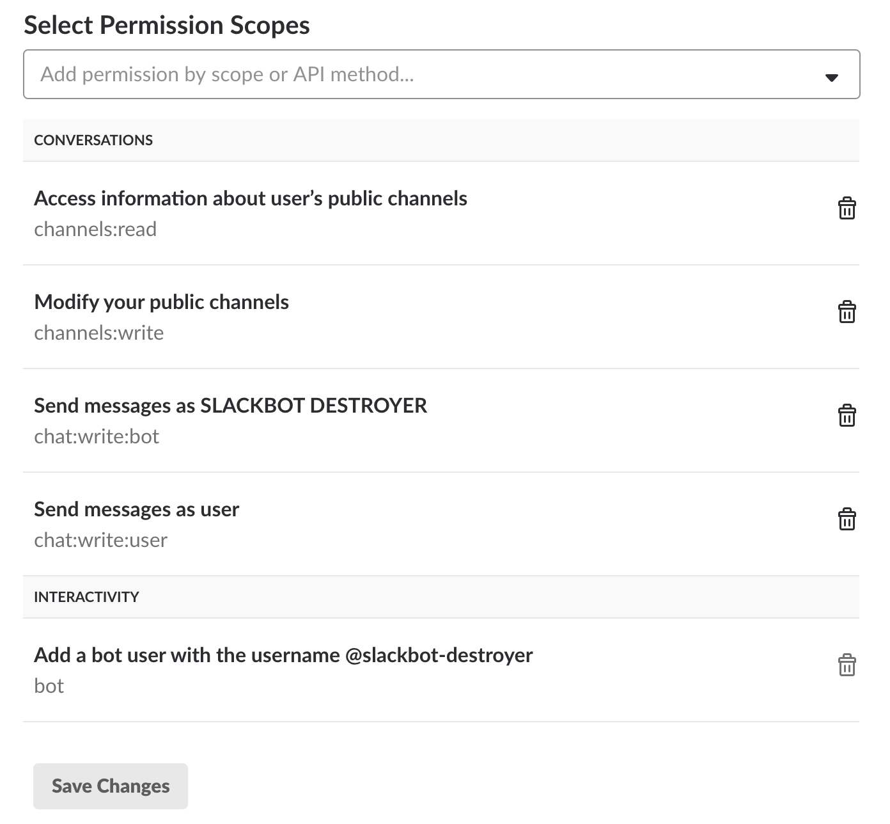
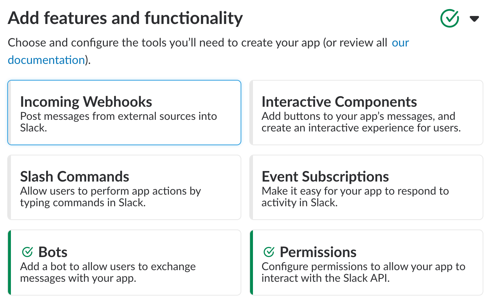
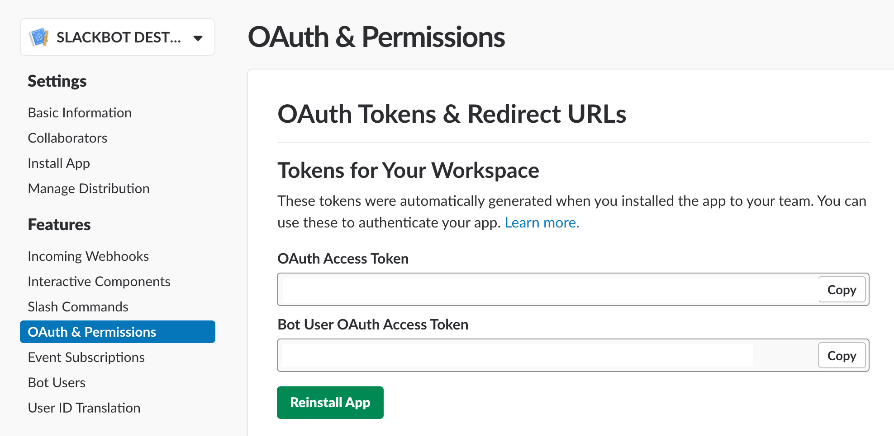

# &nbsp;&nbsp;Slackbot Destroyer :mega: :x: 

This bot deletes auto responses from Slack's very own Slackbot. If you'd like to be rid of the responses in certain channels in your organization, you can employ the `Slackbot Destroyer` to fight on your behalf.

Note that in order to delete Slackbot's messages, this bot must be installed by a user who has permission to delete Slackbot messages in Slack. Slackbot's messages will be deleted using the permissions of the user that installs Slackbot Destroyer.


## Installation

1. Go to your [organization's Slack integration page](https://api.slack.com/apps) and create a **new application**. An organization admin will need to do this as this bot requires permissions to delete messages using the credentials of an admin user.
2. Create a name for the bot and pick a workspace.\
  
3. On the next page, you'll need to add features and functionality to enable a bot user and set permissions. Click on 'Bots'
4. Configure your bot with the name you want to see in Slack and a username (we'll use this later!). Save these settings and go back to the Basic Information page.\
  
5. You need to add Permission Scopes for the bot. For full functionality, you need to add the following:\
  \
  Note that 'Add a bot user' in the Interactivity section will be automatically enabled by the previous step in the instructions.
6. Back on the Basic Information page, the Features and Functionality section should look like this now:\
  
7. You can now install the app in your Slack workspace!
8. Later, you'll need the `BOT_ID`. You can obtain this by running:
  ```bash
  export BOT_NAME=$bot_username_from_bot_user_step
  pipenv run python id.py
  ```
9. When configuring on Heroku, you'll need the two tokens from the OAuth & Permissions page for the app. The relevant section looks like this:\
  
10. Now, we need to set up the bot on Heroku (this is free). Click the button below to get started!

[](https://heroku.com/deploy?template=https://github.com/UnitedIncome/slackbot-destroyer/master)

If you'd like to run the application manually you can add the required secrets within [constants.py](constants.py) as environment variables and then run `$ python app.py`.

### Configuration on Heroku

The installation button will require you to enter a number of API keys. Below you'll find an explanation 

| Key  | Value Information | Required |
| ------------- | ------------- | ------------- |
| `BOT_ID`  | The ID of your Slack bot user, this is required so the bot knows when a command is directed at it. You can obtain this ID through the steps described in the Installation process.  | **Yes** |
| `SLACK_BOT_TOKEN`  | The bot token found within the [Slack API settings](https://api.slack.com/bot-users).  | **Yes** |
| `SLACK_USER_TOKEN`  | The user token found within the [Slack API settings](https://api.slack.com/bot-users). This must be the user token of an admin.  | **Yes** |
| `AWS_ACCESS_KEY_ID`  | Your AWS access key id, only required if you'd like to persist the bot settings.  | **No** |
| `AWS_SECRET_ACCESS_KEY`  | Your AWS access key id, only required if you'd like to persist the bot settings.  | **No** |
| `AWS_BUCKET_NAME` | The name of your S3 bucket on AWS, only required if you'd like to persist the bot settings.  | **No**  |
| `CHANNEL_WHITELIST`  | A comma seperated list of channels you'd like the bot to operate in, if this is left blank the bot will be allowed to join any channel. Requires `channels:write` and `channels:read` permissions. For example `general, random`.  | **No** |

### Configuring Persistent Storage on AWS

Heroku has no ability to do persistent storage, and will periodically reboot your dynos, causing your bot to lose its state. We have a simple data persistence option using an S3 bucket on AWS. Here are steps on AWS to configure persistent storage.

1. Log on to the AWS Console and navigate to the [S3 service](https://s3.console.aws.amazon.com/s3/home?region=us-east-1#).
2. Click on 'Create bucket', and choose a name for your bucket. This value will go in the `AWS_BUCKET_NAME` environment variable in your Heroku settings.
3. You don't need to change any other settings, so just keep clicking next to the 'Review' section, then click 'Create bucket'.
4. You will need to create an IAM user and policy for Slackbot Destroyer on the [IAM page](https://console.aws.amazon.com/iam/home?region=us-east-1#).
5. First, click on 'Policies' in the sidebar, then 'Create policy'. We're going to create a policy that will give the user read and write access to ONLY the S3 bucket we just created.
6. Click on the JSON tab in the policy editor and paste in the following:
  ```javascript
  {
      "Version": "2012-10-17",
      "Statement": [
          {
              "Effect": "Allow",
              "Action": [
                  "s3:ListBucket"
              ],
              "Resource": [
                  "arn:aws:s3:::{bucket-name-on-s3}"
              ]
          },
          {
              "Effect": "Allow",
              "Action": [
                  "s3:PutObject",
                  "s3:GetObject"
              ],
              "Resource": [
                  "arn:aws:s3:::{bucket-name-on-s3}/*"
              ]
          }
      ]
  }
  ```
7. Click on 'Review policy', and give it a name and a description on the next page, then click 'Create policy'.
8. Now navigate to 'Users' in the sidebar and click 'Add user'. Give the user a name and enable only 'Programmatic access', then click 'Next: Permissions'.
9. On the 'Permissions' page, click on 'Attach existing policies directly', and find the policy we just created. Select it, then hit 'Next: Review'.
10. Click on the 'Create user' button. **THIS IS YOUR ONLY CHANCE TO GET THE SECRET ACCESS KEY**. If you don't grab it now, you'll have to regenerate credentials for the user.
11. Copy the 'Access key ID' and 'Secret access key' to the `AWS_ACCESS_KEY_ID` and `AWS_SECRET_ACCESS_KEY` environment variables in Heroku. Click 'Close' when you're finished.
12. It may take a little time for permissions to percolate through the system. Go get a coffee! :coffee:
13. In Heroku, under 'Resources', restart the worker. Use `heroku logs` on the command line to check that everything is initialized correctly.
14. Enjoy a persistent bot!

## Commands

The following commands are available.

```
# Displays a list of available commands.
@slackbot-destroyer commands

# Activate Slackbot Destroyer in a channel.
@slackbot-destroyer destroy

# Deactivate Slackbot Destroyer in a channel.
@slackbot-destroyer deactivate

# Show how many times Slackbot Destroyer has destroyed Slackbot responses.
@slackbot-destroyer stats

# Teleport to the future
@slackbot-destroyer teleport

# Make Slackbot Destroyer moderate the frequency of Slackbot responses.
@slackbot-destroyer moderate

# Ask Slackbot Destroyer what it is doing in the current channel.
@slackbot-destroyer wassup

# Ask Slackbot Destroyer what Slackbot responses it has seen so far.
@slackbot-destroyer track

# Change the frequency of a Slackbot response (1 will always show the response and 0.1 will show it 10% of the time).
@slackbot-destroyer hunt [index from track command] [new frequency]
```

## Development

Want to mod a bot? You can develop SLACKBOT DESTROYER on OSX via the following steps:

1. Use homebrew to install pyenv
2. Use pyenv to install Python 3.6(.6)
3. Configure either local or global python to be 3.6
4. Use these [steps](https://pip.pypa.io/en/stable/installing/) to install Pip
5. Using the pip you just installed, install pipenv
6. Run pipenv install
